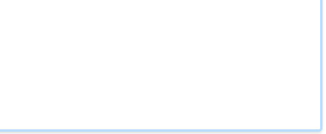

# Welcome to the Knowledge Graph (KG)
Last update: 

## Introduction

The **Knowledge Graph Template** is an updated version that is BFO-compliant, aligning with the Basic Formal Ontology to ensure semantic interoperability and ontological rigor. This updated version aims to represent consortium resources and enable integrative access to distributed, heterogeneous research data within the community and beyond.

## Navigation

- [SHMARQL endpoint](https://nfdi.fiz-karlsruhe.de/kg-template/shmarql/){:target="_blank"}
- [SPARQL endpoint](https://nfdi.fiz-karlsruhe.de/kg-template/sparql){:target="_blank"}
- [The NFDI Core Ontology (NFDIcore)](https://ise-fizkarlsruhe.github.io/nfdicore/){:target="_blank"}
- [Data collection spreadsheets](https://docs.google.com){:target="_blank"}
- [About consortium](https://nfdi.de/){:target="_blank"}
- [Contact Us](mailto:)

## Purpose

The **Knowledge Graph**:

- Provides a ...

## Content

The Knowledge Graph encompasses diverse categories:

- **A**: a, b, c, d.

---

_For more information, visit the [official website](https://nfdi.de/){:target="_blank"}._

